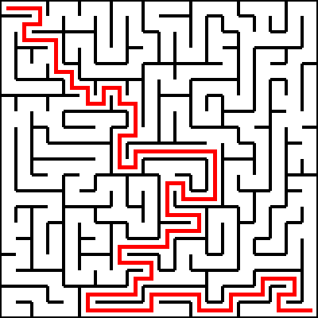
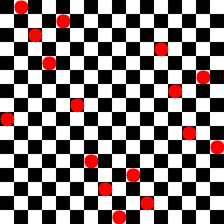
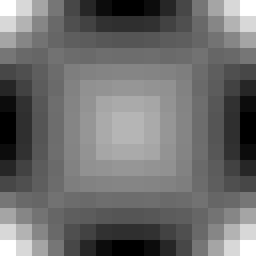

<h1 align="left">Hey 👋 I'm Mike!</h1>

###

  
  

###

I keep an consistent rubber duck to personal project ratio.

###

<h2 align="left">About me</h2>

###

💻 Uses Java and Kotlin 🧙 Master of jank 🌱 Tends to plants ☕ Enjoys coffee 😺 Has two cats

###

<h2 align="left">Languages Used</h2>

###

  
  
  
  
  
  
  
  
  
  
  
  
  
  
  
  
  

###

<h2 align="left">Project Showcases</h2>

### Solving Minesweeper (Video)

### Falling Particles (Video)

### Solving Dynamic Cost Functions (Video)

### Checkers AI Battle (Video)

### Generating Mazes (Video)

### Solving Mazes

### N-Queens (n=16) One Solution

### N-Queens Probability Distribution (n=16, #solutions=14,772,512)

### Ascii Image Conversion

###

